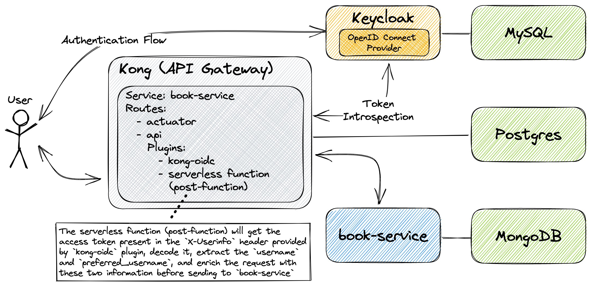

# springboot-kong-keycloak

The goal is to create a [`Spring Boot`](https://docs.spring.io/spring-boot/docs/current/reference/htmlsingle/) application to manage books, called `book-service` and secure it by using [`Kong`](https://konghq.com/kong/) API gateway and [`Keycloak`](https://www.keycloak.org) OpenID Connect Provider.

> **Note**: In [`kubernetes-minikube-environment`](https://github.com/ivangfr/kubernetes-minikube-environment/tree/master/book-service-kong-keycloak) repository, it's shown how to deploy this project in `Kubernetes` (`Minikube`)

## Proof-of-Concepts & Articles

On [ivangfr.github.io](https://ivangfr.github.io), I have compiled my Proof-of-Concepts (PoCs) and articles. You can easily search for the technology you are interested in by using the filter. Who knows, perhaps I have already implemented a PoC or written an article about what you are looking for.

## Additional Readings

- \[**Medium**\] [**Implementing and Securing a Simple Spring Boot REST API with Keycloak**](https://medium.com/@ivangfr/how-to-secure-a-spring-boot-app-with-keycloak-5a931ee12c5a)
- \[**Medium**\] [**Implementing and Securing a Simple Spring Boot UI (Thymeleaf + RBAC) with Keycloak**](https://medium.com/spring-boot/how-to-secure-a-simple-spring-boot-ui-thymeleaf-rbac-with-keycloak-ba9f30b9cb2b)
- \[**Medium**\] [**Implementing and Securing a Spring Boot GraphQL API with Keycloak**](https://medium.com/javarevisited/implementing-and-securing-a-spring-boot-graphql-api-with-keycloak-c461c86e3972)
- \[**Medium**\] [**Building a Single Spring Boot App with Keycloak or Okta as IdP: Introduction**](https://medium.com/@ivangfr/building-a-single-spring-boot-app-with-keycloak-or-okta-as-idp-introduction-2814a4829aed)

## Project Diagram



As we can see from the diagram, `book-service` will only be reachable through `Kong` API gateway.

In `Kong`, it's installed [`kong-oidc`](https://github.com/nokia/kong-oidc) plugin that will enable the communication between `Kong` and `Keycloak` OpenID Connect Provider.

This way, when `Kong` receives a request to `book-service`, it will validate together with `Keycloak` whether it's a valid request.

Also, before redirecting to the request to the upstream service, a `Serverless Function (post-function)` will get the access token present in the `X-Userinfo` header provided by `kong-oidc` plugin, decode it, extract the `username` and `preferred_username`, and enrich the request with these two information before sending to `book-service`

## Application

- ### book-service

  `Spring Boot` REST API application to manages books. The API doesn't have any security. `book-service` uses [`MongoDB`](https://www.mongodb.com) as storage.

  Endpoints
  ```
     GET /actuator/health
     GET /api/books
    POST /api/books {"isbn": "...", "title": "..."}
     GET /api/books/{isbn}
  DELETE /api/books/{isbn}
  ```

## Prerequisites

- [`Java 17+`](https://www.oracle.com/java/technologies/downloads/#java17)
- [`Docker`](https://www.docker.com/)
- [`jq`](https://stedolan.github.io/jq)

## Run application during development using Maven

- Open a terminal and navigate to `springboot-kong-keycloak` root folder

- Run the command below to start `mongodb` Docker container
  ```
  docker run -d --name mongodb -p 27017:27017 mongo:6.0.6
  ```

- Run the command below to start `book-service`
  ```
  ./mvnw clean spring-boot:run --projects book-service
  ```

- Open another terminal and call application endpoints
  ```
  curl -i localhost:9080/api/books
  curl -i -X POST localhost:9080/api/books -H "Content-Type: application/json" -d '{"isbn":"123", "title":"Kong & Keycloak"}'
  curl -i localhost:9080/api/books/123
  curl -i -X DELETE localhost:9080/api/books/123
  curl -i localhost:9080/actuator/health
  ```

- To stop
  - `book-service`, go to the terminal where it's running and press `Ctrl+C`
  - `mongodb` Docker container, go to a terminal and run the following command
    ```
    docker rm -fv mongodb
    ```

## Build application Docker Image

- In a terminal, make sure you are in `springboot-kong-keycloak` root folder

- Build Docker Image
  - JVM
    ```
    ./docker-build.sh
    ```
  - Native
    ```
    ./docker-build.sh native
    ```

  | Environment Variable | Description                                                       |
  |----------------------|-------------------------------------------------------------------|
  | `MONGODB_HOST`       | Specify host of the `Mongo` database to use (default `localhost`) |
  | `MONGODB_PORT`       | Specify port of the `Mongo` database to use (default `27017`)     |

## Test application Docker Image

- In a terminal, create a Docker network
  ```
  docker network create springboot-kong-keycloak-net
  ```

- Run the command below to start `mongodb` Docker container
  ```
  docker run -d --name mongodb -p 27017:27017 --network springboot-kong-keycloak-net mongo:6.0.6
  ```

- Run the following command to start `book-service` Docker container
  ```
  docker run --rm -p 9080:9080 --name book-service -e MONGODB_HOST=mongodb --network springboot-kong-keycloak-net ivanfranchin/book-service:1.0.0
  ```

- Open another terminal and call application endpoints
  ```
  curl -i localhost:9080/api/books
  curl -i -X POST localhost:9080/api/books -H "Content-Type: application/json" -d '{"isbn":"123", "title":"Kong & Keycloak"}'
  curl -i localhost:9080/api/books/123
  curl -i -X DELETE localhost:9080/api/books/123
  curl -i localhost:9080/actuator/health
  ```

- To stop
  - `book-service`, go to the terminal where it's running and press `Ctrl+C`
  - `mongodb` Docker container, go to a terminal and run the following command
    ```
    docker rm -fv mongodb
    ```
  - remove Docker network
    ```
    docker network rm springboot-kong-keycloak-net
    ```

## Initialize Environment

- In a terminal, make use you are in `springboot-kong-keycloak` root folder

- Run the following script
  ```
  ./init-environment.sh
  ```

> **Note**: `book-service` application is running as a Docker container. The container does not expose any port to HOST machine. So, it cannot be accessed directly, forcing the caller to use `Kong` as gateway server in order to access it.

## Configure Keycloak

- In a terminal, make sure you are in `springboot-kong-keycloak` root folder

- Run the following script to configure `Keycloak` for `book-service` application
  ```
  ./init-keycloak.sh
  ```

  This script creates:
  - `company-services` realm;
  - `book-service` client;
  - user with _username_ `ivan.franchin` and _password_ `123`.

- The `book-service` client secret (`BOOK_SERVICE_CLIENT_SECRET`) is shown at the end of the execution. It will be used in the next step

- You can check the configuration in `Keycloak` by accessing http://localhost:8080. The credentials are `admin/admin`.

## Configure Kong

- In a terminal, make sure you are in `springboot-kong-keycloak` root folder

- Create an environment variable that contains the `Client Secret` generated by `Keycloak` to `book-service` at [Configure Keycloak](#configure-keycloak) step
  ```
  BOOK_SERVICE_CLIENT_SECRET=...
  ```

- Run the following script to configure `Kong` for `book-service` application
  ```
  ./init-kong.sh $BOOK_SERVICE_CLIENT_SECRET
  ```
  
  This script creates:
  - service to `book-service`;
  - route to `/actuator` path;
  - route to `/api` path;
  - add `kong-oidc` plugin to route of `/api` path. It will authenticate users against `Keycloak` OpenID Connect Provider;
  - add `serverless function (post-function)` plugin to route of `/api` path. It gets the access token present in the `X-Userinfo` header provided by `kong-oidc` plugin, decoded it, extracts the `username` and `preferred_username`, and enriches the request with these two information before sending to `book-service`.

## Testing

- Try to call the public `GET /actuator/health` endpoint
  ```
  curl -i localhost:8000/actuator/health -H 'Host: book-service'
  ```
  It should return
  ```
  HTTP/1.1 200
  {"status":"UP"}
  ```

- Try to call the private `GET /api/books` endpoint without access token
  ```
  curl -i localhost:8000/api/books -H 'Host: book-service'
  ```
  It should return
  ```
  HTTP/1.1 401 Unauthorized
  no Authorization header found
  ```

- Get `ivan.franchin` access token
  ```
  ACCESS_TOKEN=$(./get-access-token.sh $BOOK_SERVICE_CLIENT_SECRET) && echo $ACCESS_TOKEN
  ```
  > **Note**: In `jwt.io`, you can decode and verify the `JWT` access token

- Call again the private `GET /api/books` endpoint using the access token
  ```
  curl -i localhost:8000/api/books -H 'Host: book-service' -H "Authorization: Bearer $ACCESS_TOKEN"
  ```
  It should return
  ```
  HTTP/1.1 200
  []
  ```

- You can try other endpoints using access token

  Create book
  ```
  curl -i -X POST localhost:8000/api/books -H 'Host: book-service' -H "Authorization: Bearer $ACCESS_TOKEN" \
    -H "Content-Type: application/json" -d '{"isbn": "123", "title": "Kong & Keycloak"}'
  ```
  
  Get book
  ```
  curl -i localhost:8000/api/books/123 -H 'Host: book-service' -H "Authorization: Bearer $ACCESS_TOKEN"
  ```
  
  Delete book 
  ```
  curl -i -X DELETE localhost:8000/api/books/123 -H 'Host: book-service' -H "Authorization: Bearer $ACCESS_TOKEN"
  ```

## Useful Links & Commands

- **MongoDB**

  List books
  ```
  docker exec -it mongodb mongo bookdb
  db.books.find()
  ```
  > Type `exit` to get out of MongoDB shell

## Shutdown

In a terminal and, inside `springboot-kong-keycloak` root folder, run the following script
```
./shutdown-environment.sh
```

## Cleanup

To remove the Docker image created by this project, in a terminal and, inside `springboot-kong-keycloak` root folder, run the script below
```
./remove-docker-images.sh
```

## References

- https://www.jerney.io/secure-apis-kong-keycloak-1/
- https://github.com/d4rkstar/kong-konga-keycloak

## Issues

- Unable to put up and running kong `3.x` version;
- When upgrading postgres to a version above `13.x` (using current kong version), there is an error while running `kong-database migration`
  ```
  Running kong-database migration
  -------------------------------
  Error: module 'openssl.rand' not found:No LuaRocks module found for openssl.rand
  	no field package.preload['openssl.rand']
  	no file './openssl/rand.lua'
  	no file './openssl/rand/init.lua'
  	no file './openssl/rand.lua'
  	no file './openssl/rand/init.lua'
  	no file '/usr/local/openresty/site/lualib/openssl/rand.ljbc'
  	no file '/usr/local/openresty/site/lualib/openssl/rand/init.ljbc'
  	no file '/usr/local/openresty/lualib/openssl/rand.ljbc'
  	no file '/usr/local/openresty/lualib/openssl/rand/init.ljbc'
  	no file '/usr/local/openresty/site/lualib/openssl/rand.lua'
  	no file '/usr/local/openresty/site/lualib/openssl/rand/init.lua'
  	no file '/usr/local/openresty/lualib/openssl/rand.lua'
  	no file '/usr/local/openresty/lualib/openssl/rand/init.lua'
  	no file './openssl/rand.lua'
  	no file '/usr/local/openresty/luajit/share/luajit-2.1.0-beta3/openssl/rand.lua'
  	no file '/usr/local/share/lua/5.1/openssl/rand.lua'
  	no file '/usr/local/share/lua/5.1/openssl/rand/init.lua'
  	no file '/usr/local/openresty/luajit/share/lua/5.1/openssl/rand.lua'
  	no file '/usr/local/openresty/luajit/share/lua/5.1/openssl/rand/init.lua'
  	no file '/home/kong/.luarocks/share/lua/5.1/openssl/rand.lua'
  	no file '/home/kong/.luarocks/share/lua/5.1/openssl/rand/init.lua'
  	no file '/usr/local/openresty/site/lualib/openssl/rand.so'
  	no file '/usr/local/openresty/lualib/openssl/rand.so'
  	no file './openssl/rand.so'
  	no file '/usr/local/lib/lua/5.1/openssl/rand.so'
  	no file '/usr/local/openresty/luajit/lib/lua/5.1/openssl/rand.so'
  	no file '/usr/local/lib/lua/5.1/loadall.so'
  	no file '/home/kong/.luarocks/lib/lua/5.1/openssl/rand.so'
  	no file '/usr/local/openresty/site/lualib/openssl.so'
  	no file '/usr/local/openresty/lualib/openssl.so'
  	no file './openssl.so'
  	no file '/usr/local/lib/lua/5.1/openssl.so'
  	no file '/usr/local/openresty/luajit/lib/lua/5.1/openssl.so'
  	no file '/usr/local/lib/lua/5.1/loadall.so'
  	no file '/home/kong/.luarocks/lib/lua/5.1/openssl.so'
  
    Run with --v (verbose) or --vv (debug) for more details
  ```